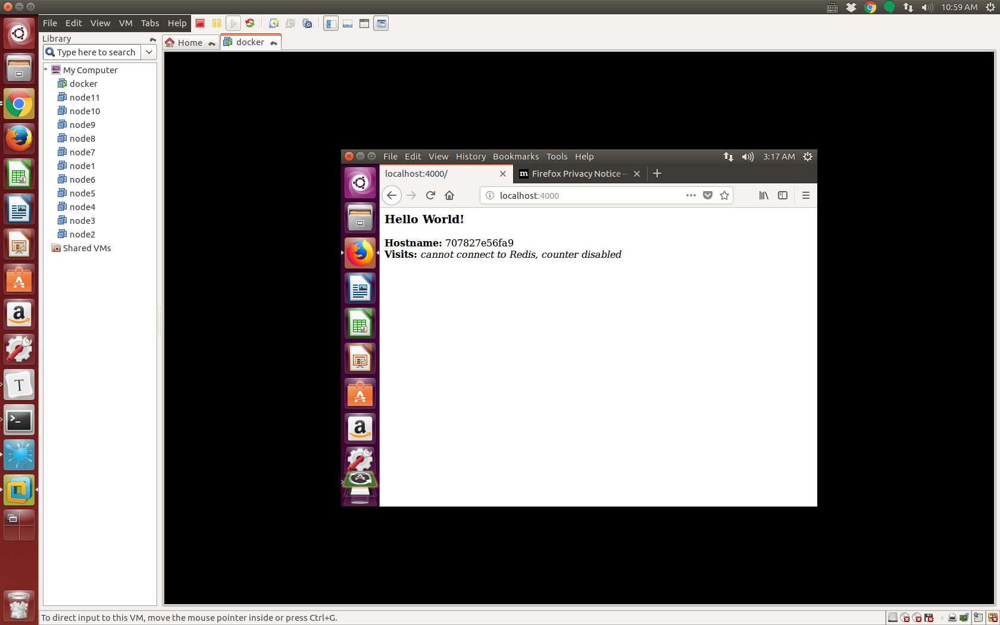
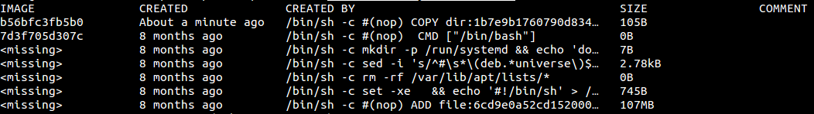
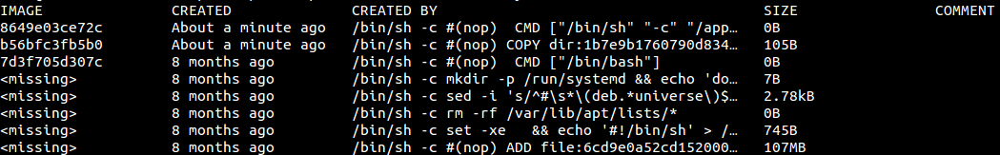

# Learn to run docker

###### installation

```bash
$> sudo apt-get remove docker docker-engine docker-ce docker.io
$> sudo apt-get update
$> sudo apt-get install     apt-transport-https     ca-certificates     curl     software-properties-common
$> curl -fsSL https://download.docker.com/linux/ubuntu/gpg | sudo apt-key add -
$> sudo apt-key fingerprint 0EBFCD88
$> sudo add-apt-repository    "deb [arch=amd64] https://download.docker.com/linux/ubuntu  $(lsb_release -cs) \
 stable"
$> sudo apt-get update
$> sudo apt-get install docker-ce
```

###### configure

for ubuntu 16.04

```bash
$> sudo mkdir -p /etc/systemd/system/docker.service.d
$> sudo vim /etc/systemd/system/docker.service.d/http-proxy.conf
```

/etc/systemd/system/docker.service.d/http-proxy.conf :

```json
[Service]
Environment="HTTP_PROXY=http://proxy.cse.cuhk.edu.hk:8000/"
```

```bash
$> sudo vim /etc/systemd/system/docker.service.d/https-proxy.conf
```

/etc/systemd/system/docker.service.d/https-proxy.conf :

```json
[Service]
Environment="HTTPS_PROXY=https://proxy.cse.cuhk.edu.hk:8000/"
```

for ubuntu 14.04

```bash
$> sudo vim /etc/default/docker
```

content:

```bash
export http_proxy=
export https_proxy=
```


###### the first container

```bash
$> sudo systemctl restart docker (16.04)
$> sudo service docker restart (14.04)
$> sudo docker run hello-world
```

###### docker without sudo permission

```bash
$> sudo usermod -aG docker $USER
```

log out and re-login

#### Build a container image

Dockerfile

```bash
# Use an official Python runtime as a parent image
FROM python:2.7-slim

# Set the working directory to /app
WORKDIR /app

# Copy the current directory contents into the container at /app
ADD . /app

# Install any needed packages specified in requirements.txt
RUN pip install --trusted-host pypi.python.org -r requirements.txt

# Make port 80 available to the world outside this container
EXPOSE 80

# Define environment variable
ENV NAME World

# Run app.py when the container launches
CMD ["python", "app.py"]

# Set proxy server, replace host:port with values for your servers
ENV http_proxy proxy.cse.cuhk.edu.hk:8000
ENV https_proxy proxy.cse.cuhk.edu.hk:8000
```

requirements.txt

```bash
Flask
Redis
```

app.py

```bash
from flask import Flask
from redis import Redis, RedisError
import os
import socket

# Connect to Redis
redis = Redis(host="redis", db=0, socket_connect_timeout=2, socket_timeout=2)

app = Flask(__name__)

@app.route("/")
def hello():
    try:
        visits = redis.incr("counter")
    except RedisError:
        visits = "<i>cannot connect to Redis, counter disabled</i>"

    html = "<h3>Hello {name}!</h3>" \
           "<b>Hostname:</b> {hostname}<br/>" \
           "<b>Visits:</b> {visits}"
    return html.format(name=os.getenv("NAME", "world"), hostname=socket.gethostname(), visits=visits)

if __name__ == "__main__":
    app.run(host='0.0.0.0', port=80)
```

pip behind proxy

```bash
$> sudo vim /etc/docker/daemon.json
```

content in daemon.json:

```bash
{
  "dns": ["137.189.91.187", "137.189.91.188", "8.8.8.8"]
}
```

```bash
$> sudo systemctl restart docker
```


build the image:

```bash
$> docker build -t friendlyhello .
$> docker build --build-arg HTTPS_PROXY=http://proxy.cse.cuhk.edu.hk:8000 --build-arg HTTP_PROXY=http://proxy.cse.cuhk.edu.hk:8000 -t friendlyhello . (14.04)
```

##### run the container

```bash
$> docker run -p 4000:80 friendlyhello
```




run in the backgound

```bash
$> docker run -d -p 4000:80 friendlyhello
63ae331181b55deb257b1da1902e6d82972f5836291d7905a80251a7d628b0bc
```

to stop

```bash
$> docker container stop \ 63ae331181b55deb257b1da1902e6d82972f5836291d7905a80251a7d628b0bc
```


##### login use my id

```bash
$> docker login
```

publish my image

```bash
$> docker tag friendlyhello ukulililixl:get-started:part2_v2
$> docker push ukulililixl/get-started:part2_v2
```

#### provide service

docker-compose.yml

```bash
version: "3"
services:
  web:
    # replace username/repo:tag with your name and image details
    image: username/repo:tag
    deploy:
      replicas: 5
      resources:
        limits:
          cpus: "0.1"
          memory: 50M
      restart_policy:
        condition: on-failure
    ports:
      - "80:80"
    networks:
      - webnet
networks:
  webnet:
```


```bash
$> docker swarm init
Swarm initialized: current node (x1d0dedyqaucosjgw6xabbewa) is now a manager.

To add a worker to this swarm, run the following command:

    docker swarm join --token SWMTKN-1-380as7x77qni74pbhgt3nm34bqk2hnbddpeflnt8tb251r1yk2-7tscsygocg38q0pyw364it9m3 172.16.83.151:2377

To add a manager to this swarm, run 'docker swarm join-token manager' and follow the instructions.
```

```bash
$> docker stack deploy -c docker-compose.yml getstartedlab
$> docker service ls
ID            NAME              MODE       REPLICAS IMAGE      PORTS
wnu41d49a2lz  getstartedlab_web replicated 5/5      ukuli...   *:80->80/tcp
```

This means in our swarm, we start 5 instance of our image to provide the service

```bash
$> docker service ps getstartedlab_web
ID           NAME                IMAGE   NODE   DESIRED STATE CURRENT STATE ...
socdm79qg0nl getstartedlab_web.1 ukuli.. ubuntu Running       Running a...               
eqb879msz867 getstartedlab_web.2 ukuli.. ubuntu Running       Running about a minute ago 
sjthtlh3imbo getstartedlab_web.3 ukuli.. ubuntu Running       Running about a minute ago 
lox9apb732rn getstartedlab_web.4 ukuli.. ubuntu Running       Running about a minute ago 
5fjsnd10nt1d getstartedlab_web.5 ukuli.. ubuntu Running       Running about a minute ago
```

```bash
$> docker container ls -q
10de774e928e
1f06198567de
7fa4fb513f2a
3605a60e3056
89d43016d57b
```

Now when we go to the web browser and go to the page "localhost", then refresh multiple times, we can see that Hostname changes as we refresh the page.

##### stop our app

```bash
$> docker stack rm getstartedlab
$> docker swarm leave --force
```

#### Swarm

A swarm is a group of machines that are running Docker and joined into a cluster. Then all the docker command is dealt by the swarm manager. 

Swarm managers can use several strategies to run containers, such as “emptiest node” -- which fills the least utilized machines with containers. Or “global”, which ensures that each machine gets exactly one instance of the specified container. You instruct the swarm manager to use these strategies in the Compose file, just like the one you have already been using.

install Docker Machine

```bash
$> curl -L https://github.com/docker/machine/releases/download/v0.13.0/docker-machine-`uname -s`-`uname -m` >/tmp/docker-machine &&
chmod +x /tmp/docker-machine &&
sudo cp /tmp/docker-machine /usr/local/bin/docker-machine
```


##### create two vm 

```bash
$> docker-machine create --driver virtualbox \
--engine-env HTTP_PROXY=http://proxy.cse.cuhk.edu.hk:8000 \
--engine-env HTTPS_PROXY=https://proxy.cse.cuhk.edu.hk:8000 \
--engine-env NO_PROXY=192.168.99.0/24 myvm1
$> docker-machine create --driver virtualbox \
--engine-env HTTP_PROXY=http://proxy.cse.cuhk.edu.hk:8000 \
--engine-env HTTPS_PROXY=https://proxy.cse.cuhk.edu.hk:8000 \
--engine-env NO_PROXY=192.168.99.0/24 myvm2
$> docker-machine ls
$> docker-machine ssh myvm1 "docker swarm init --advertise-addr 192.168.99.100"
Swarm initialized: current node (msdbr500hbjoprh62mk8noqey) is now a manager.

To add a worker to this swarm, run the following command:

    docker swarm join --token SWMTKN-1-0uccvnd5ivzrixqdlm0xt93dn1df694tyr88iq939gq8a4ws3u-24ukv43moy8o9it0239n0wgul 192.168.99.100:2377

To add a manager to this swarm, run 'docker swarm join-token manager' and follow the instructions.
$> docker-machine ssh myvm2 "docker swarm join --token SWMTKN-1-0uccvnd5ivzrixqdlm0xt93dn1df694tyr88iq939gq8a4ws3u-24ukv43moy8o9it0239n0wgul 192.168.99.100:2377"
This node joined a swarm as a worker.
```

##### App on swarm cluster

I don't know why this does not work

```bash
$> docker-machine env myvm1 --no-proxy
$> eval $(docker-machine env myvm1)
$> docker-machine ls
$> eval $(docker-machine env -u)
```

Try this:

```bash
$> docker-machine scp ./docker-compose.yml myvm1:~
$> docker-machine ssh myvm1 "docker stack deploy -c docker-compose.yml getstartedlab"
$> docker-machine ssh myvm1 "docker stack ps getstartedlab"
$> docker-machine ssh myvm1 "docker stack rm getstartedlab"
$> docker-machine rm myvm1
$> docker-machine rm myvm2
```

##### Stacks

edit docker-compose.yml

```bash
version: "3"

services:
  web:
    image: ukulililixl/get-started:part2_v2
    deploy:
      replicas: 5
      resources:
        limits:
          cpus: "0.1"
          memory: '50M'
      restart_policy:
        condition: on-failure
    ports:
      - "80:80"
    networks:
      - webnet
  visualizer:
    image: dockersamples/visualizer:stable
    ports:
      - "8080:8080"
    volumes:
      - "/var/run/docker.sock:/var/run/docker.sock"
    deploy:
      placement:
        constraints: [node.role == manager]
    networks:
      - webnet

networks:
  webnet:
```

update the swarm manager

```bash
$> docker-machine scp ./docker-compose.yml myvm1:~
$> docker-machine ssh myvm1 "docker stack deploy -c docker-compose.yml getstartedlab"
$> docker-machine ssh myvm1 "docker stack ps getstartedlab"
```

##### Persist data

This is what I interested in

##### COW test

```bash
$> mkdir cow-test
$> cd cow-test
```

create hello.sh

```bash
#!/bin/sh
echo "Hello world"
```

```bash
$> chmod +x hello.sh
```

create Dockerfile.base

```bash
FROM ubuntu:16.10
COPY . /app
```

create Dockerfile

```bash
FROM acme/my-base-image:1.0
CMD /app/hello.sh
```

build

```bash
$> docker build -t acme/my-base-image:1.0 -f Dockerfile.base .
Sending build context to Docker daemon  4.096kB
Step 1/2 : FROM ubuntu:16.10
16.10: Pulling from library/ubuntu
dca7be20e546: Pull complete 
40bca54f5968: Pull complete 
61464f23390e: Pull complete 
d99f0bcd5dc8: Pull complete 
120db6f90955: Pull complete 
Digest: sha256:8dc9652808dc091400d7d5983949043a9f9c7132b15c14814275d25f94bca18a
Status: Downloaded newer image for ubuntu:16.10
 ---> 7d3f705d307c
Step 2/2 : COPY . /app
 ---> b56bfc3fb5b0
Successfully built b56bfc3fb5b0
Successfully tagged acme/my-base-image:1.0
```

```bash
$> docker build -t acme/my-final-image:1.0 -f Dockerfile .
Sending build context to Docker daemon  4.096kB
Step 1/2 : FROM acme/my-base-image:1.0
 ---> b56bfc3fb5b0
Step 2/2 : CMD /app/hello.sh
 ---> Running in 01b2376bd0eb
Removing intermediate container 01b2376bd0eb
 ---> 8649e03ce72c
Successfully built 8649e03ce72c
Successfully tagged acme/my-final-image:1.0
```

Let's check the filesystem layer

```bash
$> docker history b56bfc3fb5b0
```



the second

```bash
$> docker history 8649e03ce72c
```



Compare these two picture, we can find the difference between the file system layers is the top layer of the second container. And this is the writable layer

 The `<missing>` lines in the `docker history` output indicate that those layers were built on another system and are not available locally. This can be ignored.

##### How storage driver perform COW operation?

When we start a container, a thin writable container layer is added on top of the other layers. If container made change to the file system, it is stored in the writable layer. The procedure is as follows in storage driver such as **aufs**,  **overlay** and **overlay2**:

* When container want to update a file, storage driver start to traverse the file system layer one by one until the file is found. Then the results are cached to speed up. (**XL: what is the cache here?Does that mean the traversed layers are added to cache?**)
* a **copy_up** operation is performed for the first copy found, to copy it to the writable layer.
* Any modification to this file is made on the copy in writable layer.

storage driver such as **BtrFS**, **ZFS** handle COW in a different way.

The **copy_up** operation may have bad performance at the first traverse, expecially for image with multiple layers.

##### Verify how COW works

```bash
$> docker run -dit --name my_container_1 acme/my-final-image:1.0 bash \
  && docker run -dit --name my_container_2 acme/my-final-image:1.0 bash \
  && docker run -dit --name my_container_3 acme/my-final-image:1.0 bash \
  && docker run -dit --name my_container_4 acme/my-final-image:1.0 bash \
  && docker run -dit --name my_container_5 acme/my-final-image:1.0 bash
$> docker ps
$> sudo ls /var/lib/docker/containers (check local storage are)
$> sudo du -sh /var/lib/docker/containers/*
```

##### about storage driver

If your Linux kernel is version 4.0 or higher, and you use Docker CE, consider using the newer [overlay2](https://docs.docker.com/storage/storagedriver/overlayfs-driver/), which has potential performance advantages over the `aufs` storage driver.

enable aufs in ubuntu 14.04

```bash
$> sudo apt-get update
$> sudo apt-get -y install linux-image-extra-$(uname -r)
$> sudo sh -c "wget -qO- https://get.docker.io/gpg | apt-key add -"
$> sudo sh -c "echo deb http://get.docker.io/ubuntu docker main\ > /etc/apt/sources.list.d/docker.list"
$> sudo apt-get update
$> sudo apt-get -y install lxc-docker
```

check whether current linux kernel support aufs

```bash
$> grep aufs /proc/filesystems
$> docker info
```

In AUFS, each image layer and container layer are represented as subdirectories in 

```bash
/var/lib/docker/aufs
```

Example:

```bash
$> docker pull ubuntu
$> cd /var/lib/docker
$> sudo ls aufs
diff  layers  mnt
```

* diff: The content of each layer

Let's look at the content of the lowested layer

```bash
$> sudo ls aufs/diff/78e935cb0cf9009a5ba6b83f84b4d77c3296770cb080a5456f522e56cd4de697
bin  boot  dev  etc  home  lib  lib64  media  mnt  opt  proc  root  run  sbin  srv  sys  tmp  usr  var
```

It is a root file system.

* layers: Metadata about how image layers are stacked. Each file under this folder represents the metadata for a layer. Specifically, the layer id of the underlined layers.

Let's look at the upper layer:

```bash
$> sudo cat aufs/layers/6c6079a98c0dc18c6fba923f43fa371a0eccc1a14a0b7df28a9170c16eb6cbdb
91f27417d1ab4a646bb8422227cdc0327c4d9fe11b2f6cf875a77fda73290b99
0c6ea11486511d59de9dccc7a6b77d4353e9c0038e5347907e1f444d099e64d3
7cc2a257b84eb633d74c647b46cb1c8eac92c0ebe38042f2be6e11c5baf744a3
b9735bc4fe5ff0df51abde4a1e884cba42582f7e8101df551cf14b641f772df7
78e935cb0cf9009a5ba6b83f84b4d77c3296770cb080a5456f522e56cd4de697    (The lowest layer)
```

* mnt: A mount point for each running container’s unified filesystem, exactly as it appears from within the container.  (**XL: Can I understand it as the home directory?**)

##### How container read/write with aufs

read:

* If the file exists in container layer, just read it in container layer. No matter whether there is other copies in underlined image layers.
* If the file does not exist in container layer, traverse the image layers until the first copy is found.

write:

* **copy-up**

delete:

* **whiteout** file is created in container to prevent the file be available 
* **opaque ** file is created in container to prevent the folder be available

