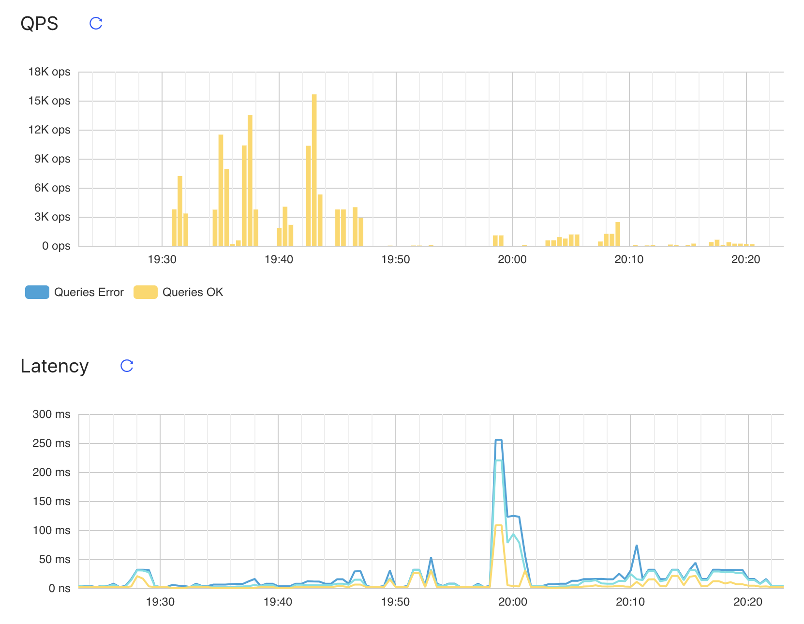

# Performance Test

### Machines and topology
* tidb, pd, tikv1, tikv2, tikv3
  - ecs.g6e.large in aliyun
    - 2 cpu
      - Intel(R) Xeon(R) Platinum 8269CY CPU @ 2.50GHz
    - Memory
      - 8 GiB
    - Disk
      - virtual block device
      - 40 GiB
- Topology
  - 1 tidb, 1 pd, 3 tikv

### Sysbench
* Install sysbench

I install sysbench in server tidb.
```bash
$> mkdir -p /tmp/sysbench
$> cd /tmp/sysbench
$> wget https://github.com/akopytov/sysbench/archive/1.0.14.tar.gz
$> sudo apt-get install make automake libtool pkg-config libaio-devel
$> sudo apt-get install libmysqlclient-dev
$> tar -zxvf 1.0.14.tar.gz
$> cd sysbench-1.0.14/
$> ./autogen.sh
$> ./configure
$> make -j
$> sudo make install
```

* Prepare data
```bash
$> sysbench --config-file=sysbench.cfg oltp_point_select --tables=16 --table-size=1000000 prepare
```

* oltp_point_select

| type | thread | tps | qps | min latency | avg latency| max latency| 95% latency |
|------|--------|-----|-----|-------------|------------|-------------|-------|
|point_select| 1 | 4124.24  |  4124.24 | 0.19  | 0.25  | 18.65  | 0.32  |
|point_select| 2 | 7280.23  |  7280.23 | 0.18  | 0.28  | 45.94  |  0.35 |
|point_select| 4 | 11657.83 |  11657.83 | 0.17  | 0.34  | 21.68  | 0.50  |
|point_select| 8 | 12614.18 |  12614.18 | 0.18  | 0.56  | 47.62  | 1.06  |
|point_select| 16| 15795.01 |  15795.01 | 0.18  | 1.02  | 32.62  | 2.26  |
|point_select| 32| 16752.43  | 16752.43  | 0.20  | 1.91  |22.91   | 4.10  |
|point_select   | 64  | 17709.79  |17709.79   |0.23   |3.62   | 64.72  | 7.70  |

* update index

| type | thread | tps | qps | min latency | avg latency| max latency| 95% latency |
|------|--------|-----|-----|-------------|------------|-------------|-------|
|update_index   | 1  | 99.88  | 99.88  | 0.43  | 10.00  | 17.62  | 15.27  |
|update_index   | 2  | 134.38  |134.38   | 0.40  | 14.86  |31.38   | 18.95  |
|update_index   | 4  | 214.16  | 214.16  | 0.39  | 18.66  | 44.99  | 23.95  |
|update_index   | 8  | 379.13  | 379.13  | 0.38  | 21.07  | 50.30  | 26.20|

* read only

| type | thread | tps | qps | min latency | avg latency| max latency| 95% latency |
|------|--------|-----|-----|-------------|------------|-------------|-------|
|read_only   | 1  | 155.87  | 2495.39  | 4.97  | 6.41  |23.74   |11.04   |
|read_only   | 2  | 248.86  | 3982.61  | 5.52  | 8.03  |60.80   |15.27   |
|read_only   | 4  | 323.15  | 5175.37  | 6.81  | 12.36  | 72.64  | 22.69  |
|read_only   | 8  | 337.73  | 5409.82  | 6.82  | 23.65  | 80.52  | 38.94  |

qps does not increase obviously.

* write only

| type | thread | tps | qps | min latency | avg latency| max latency| 95% latency |
|------|--------|-----|-----|-------------|------------|-------------|-------|
|write_only   |1   | 38.69  | 232.36  | 10.12  | 25.82  | 38.25  | 30.81  |
|write_only   |2   | 52.99  | 318.94  | 11.80  | 37.61  | 54.96  | 44.17  |
|write_only   |4   | 83.19  | 500.42  | 13.53  | 47.97  |72.43   |56.84   |
|write_only   | 8  | 148.37  | 892.64  | 15.87  |53.79   |73.27   | 63.32  |

* read write

| type | thread | tps | qps | min latency | avg latency| max latency| 95% latency |
|------|--------|-----|-----|-------------|------------|-------------|-------|
|read_write   |1   |36.09   |723.37   |15.32   |27.67   |39.89   |33.72   |
|read_write   |2   |45.99   |923.60   |17.21   |43.33   |59.52   |51.02   |
|read_write   |4   |73.09   |1468.94   |22.52   |54.50   |93.55   |68.05   |
|read_write   |8   |127.07   |2554.38   |24.29   |62.66   |113.37   |75.82   |

* screenshot for previous tests



* Tune the parameters

```yaml
server_configs:
  tidb:
    prepared-plan-cache.enabled: true
    tikv-client.max-batch-wait-time: 2000000
  tikv:
    log-level: error
    readpool.storage.normal-concurrency: 10
    rocksdb.defaultcf.block-cache-size: 2GB
    rocksdb.lockcf.block-cache-size: 2GB
    rocksdb.writecf.block-cache-size: 2GB
    server.grpc-concurrency: 6
```

* Re run tests

After I change the configuration, I re-run the tests for 8 threads.

| type | thread | tps | qps | min latency | avg latency| max latency| 95% latency |
|------|--------|-----|-----|-------------|------------|-------------|-------|
|oltp_point_select   |8   |13676.82   |13676.82   |0.18   |0.58   |19.32   |1.21   |
|update_index   |8   |376.53   |376.53   |0.40   |21.22   |50.57   |26.68   |
|read_only   |8   |395.03   |6330.31   |5.70   |20.22   |72.04   |34.33   |
|write_only   |8   |146.37   |881.64   |21.87   |54.46   |86.47   |62.19   |
|read_write   |8   |127.68   |2565.75   |31.73   |62.44   |140.13   |78.60   |

After I tune the parameter, oltp_point_select is improved. Specifically, the tail latency decrease from 47.62s to 19.32s, and qps increase from 12614.18 to 13676.82. I don't understand why there is such improvement.

Performance of oltp_read_only is also improved. qps increases from 5409 to 6330. This might because I set the readpool concurrency.

### Go-YCSB

* install go-ycsb
```bash
$> git clone https://github.com/pingcap/go-ycsb.git \
  $GOPATH/src/github.com/pingcap/go-ycsb --depth 1
$> cd $GOPATH/src/github.com/pingcap/go-ycsb
$> make
```

* run a test
```bash
$> $GOPATH/src/github.com/pingcap/go-ycsb/bin/go-ycsb load tikv -P $GOPATH/src/github.com/pingcap/go-ycsb/workloads/workloadc -p dropdata=false -p verbose=false -p debug.pprof=":6060" -p tikv.pd="http://172.31.80.111:2379" -p tikv.type="raw" -p tikv.conncount=512 -p tikv.batchsize=512 -p operationcount=1000000 -p recordcount=1000000 -p threadcount=512
...
INSERT - Takes(s): 9.7, Count: 135318, OPS: 13993.0, Avg(us): 37715, Min(us): 1503, Max(us): 484975, 99th(us): 370000, 99.9th(us): 443000, 99.99th(us): 482000
INSERT - Takes(s): 19.7, Count: 228905, OPS: 11633.8, Avg(us): 44658, Min(us): 1503, Max(us): 484975, 99th(us): 348000, 99.9th(us): 440000, 99.99th(us): 481000
WARN[0027] tikv reports `ServerIsBusy`, reason: raftstore is busy, ctx: &{{2 5 42} id:2 start_key:"usertable:user8865835259732713420" region_epoch:<conf_ver:5 version:42 > peers:<id:3 store_id:1 > peers:<id:66 store_id:4 > peers:<id:79 store_id:5 >  id:79 store_id:5  172.31.80.113:20160}, retry later
INSERT - Takes(s): 29.7, Count: 369574, OPS: 12458.5, Avg(us): 41393, Min(us): 1503, Max(us): 1966693, 99th(us): 321000, 99.9th(us): 500000, 99.99th(us): 510000
INSERT - Takes(s): 39.7, Count: 494074, OPS: 12456.4, Avg(us): 41261, Min(us): 1503, Max(us): 1966693, 99th(us): 311000, 99.9th(us): 457000, 99.99th(us): 510000
INSERT - Takes(s): 49.7, Count: 601038, OPS: 12102.0, Avg(us): 42499, Min(us): 1503, Max(us): 1966693, 99th(us): 295000, 99.9th(us): 442000, 99.99th(us): 510000
INSERT - Takes(s): 59.7, Count: 716944, OPS: 12016.3, Avg(us): 42757, Min(us): 1503, Max(us): 1966693, 99th(us): 302000, 99.9th(us): 508000, 99.99th(us): 752000
WARN[0063] tikv reports `ServerIsBusy`, reason: raftstore is busy, ctx: &{{1093 5 44} id:1093 start_key:"usertable:user5042222670442614050" end_key:"usertable:user5323892690817257462" region_epoch:<conf_ver:5 version:44 > peers:<id:1094 store_id:1 > peers:<id:1095 store_id:4 > peers:<id:1096 store_id:5 >  id:1096 store_id:5  172.31.80.113:20160}, retry later
WARN[0063] tikv reports `ServerIsBusy`, reason: raftstore is busy, ctx: &{{1093 5 44} id:1093 start_key:"usertable:user5042222670442614050" end_key:"usertable:user5323892690817257462" region_epoch:<conf_ver:5 version:44 > peers:<id:1094 store_id:1 > peers:<id:1095 store_id:4 > peers:<id:1096 store_id:5 >  id:1096 store_id:5  172.31.80.113:20160}, retry later
WARN[0063] tikv reports `ServerIsBusy`, reason: raftstore is busy, ctx: &{{1093 5 44} id:1093 start_key:"usertable:user5042222670442614050" end_key:"usertable:user5323892690817257462" region_epoch:<conf_ver:5 version:44 > peers:<id:1094 store_id:1 > peers:<id:1095 store_id:4 > peers:<id:1096 store_id:5 >  id:1096 store_id:5  172.31.80.113:20160}, retry later
INSERT - Takes(s): 69.7, Count: 833485, OPS: 11964.3, Avg(us): 42845, Min(us): 1431, Max(us): 1966693, 99th(us): 312000, 99.9th(us): 589000, 99.99th(us): 754000
INSERT - Takes(s): 79.7, Count: 891688, OPS: 11192.9, Avg(us): 45875, Min(us): 1431, Max(us): 1966693, 99th(us): 308000, 99.9th(us): 585000, 99.99th(us): 753000
Run finished, takes 1m28.725007067s
INSERT - Takes(s): 88.4, Count: 999936, OPS: 11312.9, Avg(us): 44906, Min(us): 1285, Max(us): 1966693, 99th(us): 307000, 99.9th(us): 584000, 99.99th(us): 752000
$> $GOPATH/src/github.com/pingcap/go-ycsb/bin/go-ycsb run tikv -P $GOPATH/src/github.com/pingcap/go-ycsb/workloads/workloadc -p verbose=false -p debug.pprof=":6060" -p tikv.pd="http://172.31.80.111:2379" -p tikv.type="raw" -p operationcount=1000000 -p recordcount=1000000 -p threadcount=512
...
READ   - Takes(s): 9.9, Count: 373351, OPS: 37688.8, Avg(us): 13704, Min(us): 148, Max(us): 283743, 99th(us): 47000, 99.9th(us): 110000, 99.99th(us): 271000
READ   - Takes(s): 19.9, Count: 778016, OPS: 39060.1, Avg(us): 13160, Min(us): 148, Max(us): 283743, 99th(us): 45000, 99.9th(us): 85000, 99.99th(us): 132000
Run finished, takes 25.521051424s
READ   - Takes(s): 25.4, Count: 999936, OPS: 39344.5, Avg(us): 12977, Min(us): 148, Max(us): 283743, 99th(us): 44000, 99.9th(us): 81000, 99.99th(us): 171000
```

### TPC-C

* install

```bash
$> git clone https://github.com/pingcap/go-tpc.git
$> make build
$> git clone -b 5.0-mysql-support-opt https://github.com/jackysp/benchmarksql.git
$>  cd benchmarksql; ant
$>
```

I fail to load data into tidb due to the following error. I don't know how to solve it.
```
Worker 000: Loading ITEM
Worker 001: Loading Warehouse      1
Worker 002: Loading Warehouse      2
Worker 003: Loading Warehouse      3
Worker 002: ERROR: PD server timeout
Worker 001: ERROR: PD server timeout
Worker 000: ERROR: PD server timeout
Worker 003: ERROR: PD server timeout
```
