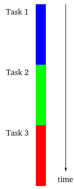
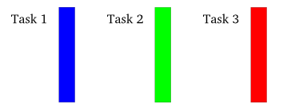
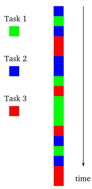

# Asynchronous programming model

##### Recall synchronous programming model

This is synchronous programming model. Task 2 can start only if Task1 has finished.

##### Recall multi-threading programming model

This is the programming model of multi-threading program. We can think it in this way: those tasks can be created at the same time and they can run at the same time. We have no rights to schedule these tasks in user space code. And it is Operating System's responsibility to schedule these tasks.

##### Asynchronous programming model

In asynchronous programming model, each time there only runs one task. The difference is that in asynchronous programming model, user can schedule the tasks in user space code.

##### Why asynchronous?

We can think about when is asynchronous needed? When a task has to be blocked. e.g. large IO.

However, I still have the **question**  that when there is large IO, will a task be blocked or os will set aside it and schedule other tasks?

If we use asynchronous programming, at the time that a task is blocked, then we can schedule other tasks to run.

So this is why twisted as a network library has been popularly used in **Client-Server** model, especially for server side code.