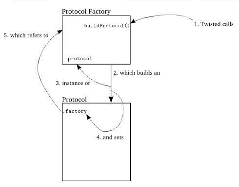
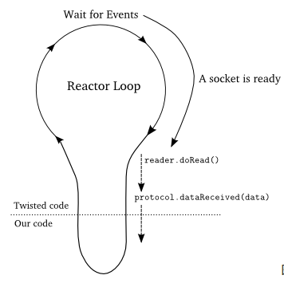

# Abstractions in twisted

#### Transport

A **Transport** represents a single connection which can be used to receive and send bytes. For the PoetryClient, **Transport**  is the abstraction of TCP connection. Twisted can also support UDP connections or pipe.

**Transport** is defined in the **interface** module as **ITransport**. When we read the source code of **ITransport**, there is not functions to read data. Why? The tutorial says that **Transport** accomplish the reading work in low level and use callback to send user data. (**XL**: I don't understand this, what is the call back?)

When use **Transport** to send data, it also does not send immediately, but will send out at proper time to avoid blocking IO.

We do not implement Transport interface by ourselves. We implement some class provided by twisted.

#### Protocols

**Protocols** is defined in **interface** as **IProtocol**. The implementation of **IProtocol** should implement some network protocols, e.g. FTP, IMAP.

The instance of **protocol** provide parsers for a connection(**Transport**).

#### Protocol Factories

**Protocol Factory** can provide instance of **Protocol**


Actually, I haven't understand these concepts yet, I need to read some example code.

------

## Usage of Abstractions

Now I follow the tutorial to read some source code to get a feel of how abstraction works.

In the main function:

```python
factory = PoetryClientFactory(len(addresses))

from twisted.internet import reactor
for address in addresses:
    host, port = address
    reactor.connectTCP(host, port, factory)
```

Here we use **connectTCP**, the 3rd parameter is our custom ProtocolFactory. This will let reactor to let factory create protocol. Then what is the protocol that the factory should create?

Then we go to the source code of **PoetryClientFactory**

```python
class PoetryClientFactory(ClientFactory):

    task_num = 1

    protocol = PoetryProtocol # tell base class what proto to build

    def __init__(self, poetry_count):
        self.poetry_count = poetry_count
        self.poems = {} # task num -> poem

    def buildProtocol(self, address):
        proto = ClientFactory.buildProtocol(self, address)
        proto.task_num = self.task_num
        self.task_num += 1
        return proto
```

We can see that PoetryClientFactory has a built in protocol type **PoetryProtocol**.

Here is how reactor create Protocol:



1. reactor call the **buildProtocol** function in **Protocol Factory**, this is why we need to implement this function when we create custom ProtocolFactory
2. Then the **Protocol Factory** will create an instance of custom **Protocol**. Here the constructor of custom protocol will be used.
3. The type of custom protocol is set when initialize protocol factory
4. After an instance of **Protocol** is created, the custom factory will be assign to the **factory** field in the instance. This is interesting: Say if we have some variables in factory field. And then we use factory to create many instance of Protocol. Now all these instance can get access to the variables in factory via the factory referece in **Protocol**!
5. Specially, there is a field **transport** inside Protocol, each instance of **Protocol** will be connect to an instance of **Transport**. However, twisted do this for us via the **makeConnection** function.


Here is the code stack of this example:


Actually, this example is on level higher than the previous example. In previous example, we implement doRead function by ourselves. In this example we leverage the interface **Protocol**.


**From what I can understand now, we should be very familiar with the low level interface to use the existing call back functions. And I don't know whether this is a good way to design a system like this. There is so many call back from high level to low level and sometimes we may lost in those floodings of callbacks**.

