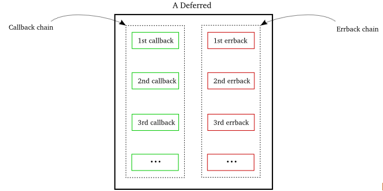
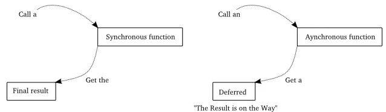

# Deferred

What is deferred?

It has a callback chain and a errback chain.

We can add some callback functions and errback functions into deferred, then when some event happens, deferred will be triggered.

It is usually to see in twisted programs that we get a defer.

When we get a defer, this means that the result might be on the way. When there is result, or there is error, some callback function or errback function will be triggered.