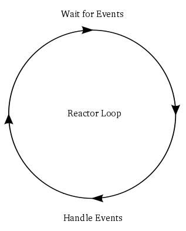

# To Get a Feel of Reactor

In the example code, the client want to download content from 3 servers.


In synchronous mode, the client download form the 3 servers one after another. So the client first download file1, then file2, after that file3.


In asynchronous mode, the client use a function from **select** library:

```python
while (...):
	rlist, _, _ = select.select(sockets, [], [])
```

Here, **sockets** is the list of the 3 connections. This line of code listens for the 3 connections until there is reponse from some connections.

Once there is response returned by this line of code, we can start to read data in the response:

```python
for sock in rlist:
    ......
```

So in the asynchronous mode, each time we might read contents from several servers.


Such programming model is called **reactor**:




Actually, the real **reactor** should be independent of the type of jobs. However, in this example, the "select" function is tighted to the job (download files). (**XL:** I'm nore sure whether I understand it properly).

------

## reactor in Twisted

1. we need to import library:

```python
from twisted.internet import reactor
```

2. to start a reactor

```python
reactor.run()
```

3. There is only one reactor in a program (**XL:** what is singleton model??)

```python
reactor.callWhenRunning(custom function)
```

This function is called before we start reactor, this function tells that when reactor starts, it will call the custom function

------

## Something about call back


Reactor use callbacks to run user's custom code.

```python
reactor.callLater(time, function)
```

We can use callLater to add callback. callLater tells reactor to call the function after a time period.

